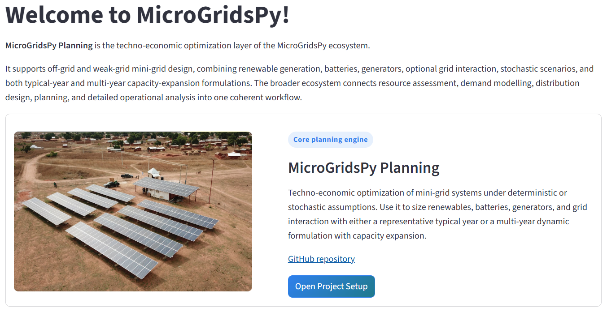

# MicroGridsPy - Mini-Grid Planning Optimization

MicroGridsPy is an open-source Python package for the techno-economic planning of mini-grid energy systems in remote and underserved areas. It is built on Linopy for mathematical optimization and ships with an optional Streamlit graphical interface.

You can use it two ways:
- **As a Python library** — call the optimization from your own scripts and notebooks (`import microgridspy`).
- **As a guided app** — define a project, generate input templates, audit data, solve, and explore results in a Streamlit workspace (`microgridspy-gui`).

> [!NOTE]
> **Work in progress.** Recent development work has strengthened inverter modeling and results reliability across both planning modes, but this area is still being actively refined.
>
> - Typical-Year renewable inverter sizing is now physically consistent across constraints, objective accounting, exports, and the Results page.
> - Typical-Year battery inverter sizing now follows the same component-based philosophy as the other core assets:
>   `battery inverter installed power = battery_inverter_units x battery_inverter_nominal_power_kw`
>   Discrete sizing therefore applies naturally to battery inverter components as integer unit counts.
> - Typical-Year reporting now exposes structured inverter outputs directly, including renewable inverter design, battery inverter design, and inverter metrics.
> - Typical-Year results are packaged through a cleaner canonical solved-results object, improving robustness when reloading or rendering saved outputs.
> - Multi-Year now includes a first inverter pass with renewable inverter/converter treatment per renewable technology/resource, explicit battery inverter sizing by investment step, and inverter-aware objective accounting and structured exports.
> - Multi-Year results have also been refactored toward a cleaner canonical pipeline so that solve, export, live rendering, and file-backed rendering are better aligned.

The reference energy system can include:
- Renewable generation
- Battery storage
- Backup generators
- Optional grid connection
- Optional grid export

The app supports both simple and advanced studies, including:
- Typical-year and multi-year formulations
- Single-scenario and multi-scenario analyses
- Continuous and discrete sizing
- Optional carbon-cost internalization
- Renewable land constraints
- Capacity expansion over time

Each project is stored in its own folder with CSV, YAML, and JSON files, so studies remain reproducible, inspectable, and easy to revisit.



---

## Installation

MicroGridsPy is published on PyPI. Install it into a Python 3.10+ environment:

```bash
pip install "microgridspy[gui,highs]"
```

Extras let you install only what you need:

| Extra | Adds | Use it for |
| --- | --- | --- |
| _(none)_ | the core library | scripting / notebooks, no GUI |
| `gui` | Streamlit interface | the `microgridspy-gui` app |
| `highs` | HiGHS solver | open-source solving |
| `gurobi` | `gurobipy` | commercial solver (license required) |

For example, `pip install microgridspy` gives a lean library with no GUI, while `pip install "microgridspy[gui,highs]"` installs everything needed to run the app with the open-source solver.

### Launch the app

```bash
microgridspy-gui
```

The app looks for a `projects/` folder in the current directory (or in the folder set by the `MICROGRIDSPY_WORKSPACE` environment variable).

---

## Using MicroGridsPy as a Python library

The package exposes a small, stable API:

```python
import microgridspy as mgp

# create a new project and scaffold its input templates
mgp.create_project("my_site", formulation="steady_state", resources=["solar", "wind"])
# ...fill in projects/my_site/inputs (load demand, resource availability, *.yaml)...

mgp.validate_project("my_site")  # pre-flight input check
model = mgp.solve("my_site", solver="highs")  # build + solve
results = model.results()  # analysis-ready pandas tables
print(results.kpis)
mgp.export_results(results)  # write CSV/Excel to the project folder
```

Key entry points: `solve`, `create_project`, `validate_project`, `load_results`, `export_results`, `list_projects`, `set_workspace`, and the model classes `SteadyStateModel` / `MultiYearModel`. See the `examples/` folder for a runnable script.

---

## What The App Does

MicroGridsPy Planning combines project setup, input-template generation, data audit, optimization, and result interpretation in a single interface.

It is intended to support a complete workflow:
1. Define the structure of the planning problem.
2. Generate the input templates required by that problem.
3. Fill and validate the CSV and YAML inputs.
4. Solve the optimization model.
5. Inspect design, dispatch, cost, and reliability results.

This makes the tool useful both for early-stage feasibility studies and for more detailed long-term planning exercises.

---

## Intended Workflow And User Experience

The application is organized as a sequence of Streamlit pages that progressively define, validate, solve, and interpret a planning problem.

### 1. Project Setup

The first page defines the global structure of the study:
- Off-grid or on-grid configuration
- Technologies included in the system
- Typical-year or multi-year formulation
- Deterministic or multi-scenario setup
- Economic and policy settings
- Optional modelling features such as carbon cost or discrete sizing

These choices determine the shape of the optimization problem and the set of input templates generated for the user.

### 2. Input Template Generation

Based on the selected configuration, the application creates structured templates tailored to the project:
- CSV files for time series
- YAML files for techno-economic parameters
- JSON settings for workflow and formulation choices

This helps keep user inputs consistent with the actual model dimensions and enabled technologies.

### 3. Data Audit And Visualization

Before optimization, the user can inspect and validate the generated inputs through:
- Dataset structure summaries
- Parameter overviews
- Optimization-constraint summaries
- Time-series visualizations
- Grid availability checks for on-grid systems

This step is useful for detecting mistakes before solving.

### 4. Optimization

The optimization page builds and solves the mathematical model using:
- HiGHS
- Gurobi

The model computes the least-cost system design and dispatch subject to the selected technical, economic, and policy constraints.

### 5. Results

The results page provides access to:
- Optimal capacities
- Dispatch plots
- Energy-balance views
- Cost breakdowns
- Emissions indicators
- Reliability metrics
- Scenario-dependent outputs

For multi-year studies, the app also supports year-by-year and investment-step interpretation.

---

## Planning Modes

MicroGridsPy Planning supports two complementary formulations.

### Typical-Year Planning

The typical-year formulation represents the system with a single representative year.

It is most appropriate when:
- Demand and resource conditions are assumed to be stationary
- Capacity expansion is not required
- A compact, computationally efficient model is preferred

The objective is based on expected equivalent annual cost, combining annualized investment costs and expected operating costs.

### Multi-Year Planning

The multi-year formulation represents the system over an explicit planning horizon.

It is most appropriate when:
- Demand evolves over time
- Capacity expansion is relevant
- Degradation, replacement, and investment timing matter
- Long-term trade-offs need to be assessed explicitly

The objective is based on expected net present cost and includes the time value of money, operating costs, and remaining asset value where applicable.

---

## Planning Modes Comparison

The two planning modes serve different purposes. The table below summarizes their main strengths and limitations.

| Aspect | Typical-Year Planning | Multi-Year Planning |
| --- | --- | --- |
| Visual cue | 🟢 Compact and fast | 🔵 Richer and more realistic |
| Main purpose | Representative-year planning and rapid screening | Long-term planning across an explicit horizon |
| Time structure | One recurring representative year | Multiple consecutive years |
| Investment logic | Single design decision with annualized costs | Time-dependent investments with discounted cash flows |
| Capacity expansion | Not represented explicitly | Supported when enabled |
| Degradation and replacement | Not modeled explicitly in time | Can be represented across the planning horizon |
| Computational effort | Lower | Higher |
| Input complexity | Lower | Higher |
| Best suited for | Early feasibility, technology comparison, sensitivity screening | Expansion planning, staged investment analysis, long-term policy studies |
| Main advantages | Simple setup, fast solve times, easier scenario exploration | More realistic timing of investments and operations, better long-term interpretation |
| Main limitations | Cannot capture timing of expansion, aging, or horizon effects | More data-intensive, heavier computationally, more complex to interpret |

### Quick Guidance

- Choose `Typical-Year` when you need a simpler and faster model for screening alternatives or understanding the basic least-cost structure of the system.
- Choose `Multi-Year` when investment timing, degradation, grid arrival, evolving demand, or staged expansion materially affect the planning outcome.

---

## Main Modeling Features

Depending on project setup, the application can represent:
- Off-grid and on-grid systems
- Optional grid export
- Renewable, battery, and generator investment
- Generator partial-load efficiency curves
- Scenario-weighted uncertainty
- Land-use limits for renewables
- Lost-load constraints and penalties
- Minimum renewable penetration targets
- Carbon-cost inclusion in the objective
- Continuous sizing or discrete unit-based sizing
- Capacity expansion over multiple investment stages

---

## Input Structure

Each project is stored under its own folder and typically contains:

### Core configuration
- `formulation.json`

### Time-series inputs
- `load_demand.csv`
- `resource_availability.csv`
- `grid_import_price.csv`
- `grid_export_price.csv`
- `grid_availability.csv`

### Technology inputs
- `renewables.yaml`
- `battery.yaml`
- `generator.yaml`
- `generator_efficiency_curve.csv`
- `grid.yaml`

The exact set of files depends on whether the project is typical-year or multi-year, off-grid or on-grid, and whether optional features such as export or partial-load modeling are enabled.

---

## Solvers

Supported optimization solvers:
- `HiGHS`: open-source and recommended as the default option
- `Gurobi`: commercial solver, useful for harder MILP cases or larger studies

If you select HiGHS in the app, make sure the `highspy` package is installed (`pip install "microgridspy[highs]"`).

---

## Contacts

For questions, feedback, or collaboration:

- Alessandro Onori - `alessandro.onori@polimi.it`
