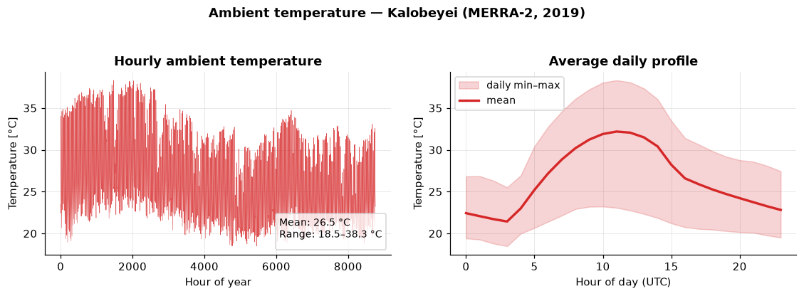

# The Kalobeyei Case Study

All the examples in this section use the case of **Kalobeyei**, a remote settlement in
northern Kenya that is currently **not connected to the national grid**. Like many rural
communities in Sub-Saharan Africa, households and businesses still rely largely on
traditional energy sources such as kerosene, diesel, and biomass.

This makes Kalobeyei a realistic testbed for MicroGridsPy: it combines a genuine electricity
demand, good solar potential, and the kind of planning uncertainty — growing demand, possible
future grid arrival — that off-grid planners face in practice.

## The community

The demand is built bottom-up from the settlement's users:

- around **700 households**, classified into three groups by their actual and expected
  appliance ownership;
- **2 primary schools** (roughly 30 lights each, plus some external lighting);
- **1 dispensary** with three rooms and seven beds;
- **productive activities**: tailoring workshops, bars, and garages.

## Demand assessment

Before running any optimization, MicroGridsPy characterizes the local demand through an
hourly time series for the representative year. The daily average profile is typical of a
small rural settlement: low overnight consumption, a daytime rise driven by productive uses,
and a pronounced **evening peak** when lighting and social activity coincide.

*Average daily load. The evening peak reaches roughly 80 kW, with an average daily demand of
about 1100 kWh.* In some scenarios (from [Planning for Growth](planning-for-growth.md)
onward) this demand is scaled up year by year to represent settlement growth.

## Resource assessment

The other primary input is the availability of the renewable resource, again provided as an
hourly time series. Kalobeyei has **strong and stable solar potential**, which makes solar PV
the natural backbone of the system.

*Average daily solar capacity factor.* Wind was also assessed for the site but is more
variable and generally lower, so it contributes little to the least-cost design; the examples
therefore model **solar PV** as the single renewable technology. The resource time series
were generated for the site's coordinates using open resource databases.

## Ambient temperature

A third time series matters once battery ageing is modelled physically rather than assumed.
Both mechanisms in the semi-empirical degradation model — calendar fade and cycle fade —
are **temperature-dependent**, so [Scenario 3](technology-choice.md#scenario-3-modelling-battery-ageing-instead-of-assuming-it)
needs an hourly ambient temperature profile for the site.

*Hourly 2 m air temperature for the site (left) and the average daily profile with its
daily min–max band (right). Source: [Renewables.ninja](https://www.renewables.ninja/)
Point API, MERRA-2 reanalysis at 3.770 °N / 34.625 °E, calendar year 2019.*

Turkana is hot and the daily swing is large: the annual mean is **26.5 °C**, but hours range
from **18.5 °C** to **38.3 °C**, with roughly an 11 °C spread between night and mid-afternoon.
That variation is not cosmetic — it makes the cycle-fade coefficient vary by more than a
factor of two over the year, so a kWh cycled through the battery on a hot afternoon costs
materially more ageing than the same kWh at night. The series is one representative year,
repeated across the 10-year horizon like the demand and resource inputs.

These inputs — demand, resource availability, and (where degradation is modelled) ambient
temperature — define the operating conditions under which every scenario is optimized.

## Shared assumptions

Unless a scenario explicitly changes them, all six examples use the same techno-economic and
project settings. This is what makes their results directly comparable.

| Setting | Value |
|---|---|
| Planning horizon | 10 years (2026–2035) |
| Social discount rate | 7.4 % |
| Formulation | multi-year (dynamic) |
| Max Lost-load constraint | enforced 0 % (unmet demand not allowed) |
| Minimum renewable penetration | not enforced |
| Integer (discrete) capacity units | disabled |
| Land constraint | not enforced |
| Generator efficiency model | constant efficiency (no part-load curve) |
| Battery loss model | constant efficiency |
| Battery degradation | exogenous capacity fade only |
| Diesel fuel cost | 1.3 USD/litre (constant across years) |

### Techno-economic inputs

| Parameter | Solar PV | Diesel generator | Li-ion battery | Lead-acid battery |
|---|--:|--:|--:|--:|
| Capital cost | 1200 USD/kW | 400 USD/kW | 300 USD/kWh | 200 USD/kWh |
| WACC | 5 % | 5 % | 5 % | 5 % |
| Lifetime | 25 y | 20 y† | 10 y | 8 y |
| Fixed O&M (of CAPEX/yr) | 1.8 % | 4.5 % | 2 % | 2 % |
| Efficiency | inverter 0.98 | full-load 0.34 | charge/discharge 0.93 | charge/discharge 0.86 |
| Operating limits | DC/AC ratio 1.2 | — | DoD 0.8; C-rate 0.25 | DoD 0.5; C-rate 0.167 |
| Exogenous degradation | 0 %/y | 0 %/y | 0.5 %/y | 0.3 %/y |

<small>Diesel LHV = 10.14 kWh per unit of fuel. Battery inverter cost = 160 USD/kW; PV
inverter cost = 180 USD/kWac; inverter lifetime = 15 y; inverter fixed O&M = 1 %
of CAPEX per year. †The generator lifetime is 20 y in every scenario except
[capacity expansion](planning-for-growth.md#scenario-5-capacity-expansion), which uses 10 y
so that each investment step carries its own generator annuity. Emissions are zero in
scenarios 1–6; the [carbon-cost scenario](uncertainty.md#scenario-7-carbon-cost) prices all
three scopes — diesel combustion at 2.69 kgCO₂e per unit of fuel (scope 1), grid imports at
0.35 kgCO₂e/kWh (scope 2), and embodied emissions of 500 kgCO₂e/kW for PV and
100 kgCO₂e/kWh for the battery (scope 3). Full inputs are in each project's `inputs/`
folder — see the [reproducibility mapping](index.md#reproducibility).</small>

With the site characterized, we can start comparing planning strategies, beginning with
[Technology Choice](technology-choice.md).
