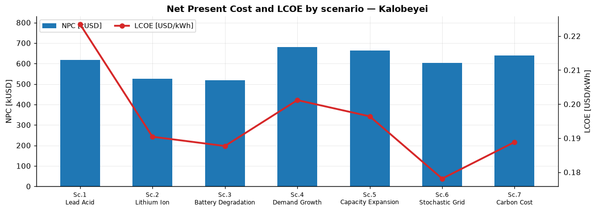
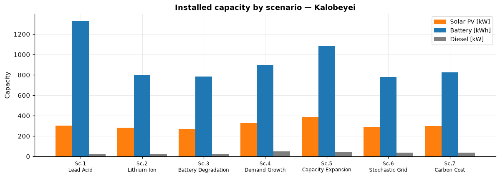

# Examples — the Kalobeyei Showcase

This section moves from theory to practice. Rather than looking at a single model run, it
walks through a **connected series of scenarios** built on one real case study — the village
of **Kalobeyei** in northern Kenya — and shows how the optimal energy system changes as we
progressively add realism and planning complexity.

The goal is not only to read the final results, but to understand **why** different planning
assumptions lead to different system designs.

!!! abstract "What you will see"
    Starting from a simple off-grid hybrid mini-grid, we introduce — one layer at a time — a
    different storage technology, a physically-grounded battery ageing model, growing demand,
    staged (multi-step) investment, uncertainty about future grid connection, and finally an
    environmental externality (carbon cost). Each step reuses the previous set-up and changes
    only what the lesson is about.

## The scenario roadmap

```text
1. Baseline            off-grid hybrid: solar PV + diesel + lead-acid battery, constant demand
        │  swap the storage technology
2. Lithium-ion         same system, lithium-ion instead of lead-acid
        │  replace the assumed ageing rate with a physical model
3. Battery degradation semi-empirical cycle + calendar fade, driven by site temperature
        │  let demand grow
4. Demand growth       +5 %/year demand over the 10-year horizon
        │  allow phased investment
5. Capacity expansion  the same growth, built in two investment steps
        │  add uncertainty
6. Stochastic grid     two possible futures for when (and how reliably) the grid arrives
        │  price emissions
7. Carbon cost         the same futures, with CO₂ costs inside the objective
```

## Results at a glance

The seven scenarios share the same site, demand shape, and techno-economic assumptions, so
their headline results are directly comparable.



*Expected Net Present Cost (NPC) and Levelized Cost of Electricity (LCOE) for the seven
scenarios.*



*Final installed capacity by technology. Demand growth enlarges every component; grid access
and carbon pricing shift the mix toward renewables.*

| # | Scenario | NPC (kUSD) | LCOE (USD/kWh) | Solar PV (kW) | Battery (kWh) | Diesel (kW) | Renewable share |
|---|---|--:|--:|--:|--:|--:|--:|
| 1 | Baseline — lead-acid | 618.0 | 0.223 | 302 | 1332 | 26 | 91.6 % |
| 2 | Lithium-ion | 526.6 | 0.190 | 281 | 795 | 26 | 91.2 % |
| 3 | Battery degradation | 519.0 | 0.188 | 271 | 782 | 27 | 90.5 % |
| 4 | Demand growth | 680.0 | 0.201 | 329 | 897 | 49 | 85.1 % |
| 5 | Capacity expansion | 663.9 | 0.196 | 386 | 1087 | 45 | 88.9 % |
| 6 | Stochastic grid | 602.0 | 0.178 | 285 | 780 | 39 | 78.4 % |
| 7 | Carbon cost | 638.4 | 0.189 | 300 | 825 | 38 | 81.1 % |

<small>All monetary values are expected (probability-weighted) present values in real USD.
Capacities are end-of-horizon values. Renewable share is the horizon renewable
contribution; grid imports count as non-renewable.</small>

## How to read this section

The examples are grouped into three short chapters, each pairing two scenarios:

- **[The Kalobeyei Case Study](case-study.md)** — the community, and the demand and resource
  inputs shared by every scenario.
- **[Technology Choice](technology-choice.md)** — baseline lead-acid vs. lithium-ion, why a
  cheaper component does not mean a cheaper system, and what changes when battery ageing is
  modelled physically instead of assumed.
- **[Planning for Growth](planning-for-growth.md)** — demand growth, and staged capacity
  expansion as an adaptive response.
- **[Uncertainty & Externalities](uncertainty.md)** — stochastic grid connection and carbon
  pricing.

## Reproducibility

Every scenario is a complete project under `projects/` in the repository, solved with the
same MicroGridsPy version. The figures on these pages are regenerated directly from each
project's `results/` folder, so the numbers here match what you get by re-solving the inputs.

| Scenario | Project folder |
|---|---|
| 1 — Baseline (lead-acid) | `projects/Kalobeyei_1` |
| 2 — Lithium-ion | `projects/Kalobeyei_2` |
| 3 — Battery degradation | `projects/Kalobeyei_3` |
| 4 — Demand growth | `projects/Kalobeyei_4` |
| 5 — Capacity expansion | `projects/Kalobeyei_5` |
| 6 — Stochastic grid connection | `projects/Kalobeyei_6` |
| 7 — Carbon cost | `projects/Kalobeyei_7` |

To re-solve any scenario:

```python
import microgridspy as mgp

model = mgp.solve("Kalobeyei_2", solver="highs")  # lithium-ion reference
results = model.results()
print(results.kpis)
```

!!! note "Solving scenario 3"
    The semi-empirical degradation model discretises the battery into state-of-charge bands,
    which makes scenario 3 roughly four times larger than the others (3.2 M rows against
    0.9 M) and much slower to solve. The published run used Gurobi with `Crossover=0`:
    barrier converges in about four minutes, whereas the crossover to a vertex solution ran
    for over an hour without changing the objective.

    ```python
    mgp.solve("Kalobeyei_3", solver="gurobi", solver_params={"Method": 2, "Crossover": 0})
    ```
