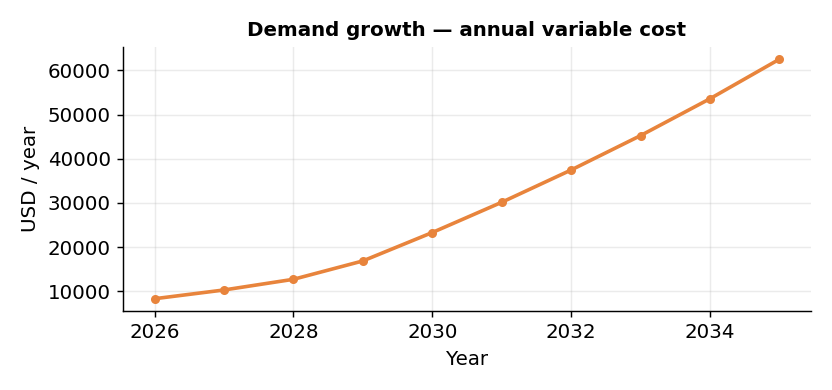
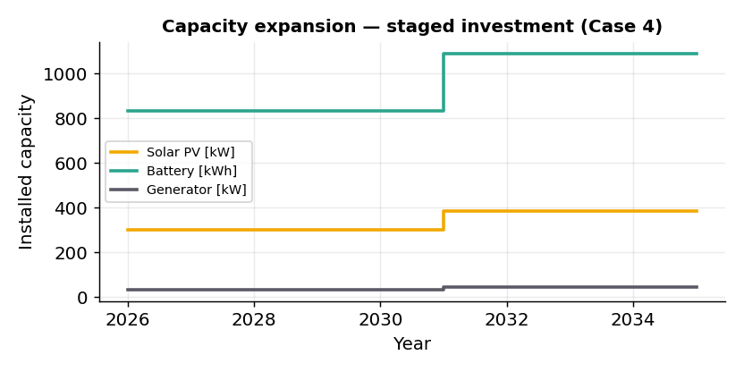
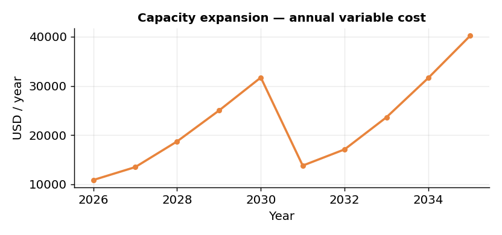

# Planning for Growth

*Scenarios 3–4 · demand grows +5 %/year · off-grid · lithium-ion*

Real communities rarely stand still. After electrification, demand typically grows as
households acquire appliances and new businesses and productive uses appear. These two
scenarios ask how the least-cost system should respond — first by sizing for growth, then by
**staging** the investment over time.

## Scenario 3 — Demand growth

We keep the lithium-ion off-grid system from [Scenario 2](technology-choice.md#scenario-2-lithium-ion)
but let electricity demand **increase by 5 % per year** over the 10-year horizon. Because the
demand trajectory now changes, this becomes the new reference case for the growth analysis.

As expected, the model installs more of everything to meet the rising load — and diesel in
particular grows more sharply, because it guarantees reliability during the hours when solar
alone cannot keep up with a larger demand.

| Quantity | Lithium-ion (constant) | Demand growth | Change |
|---|--:|--:|--:|
| Solar PV | 281 kW | 329 kW | +17 % |
| Battery | 795 kWh | 897 kWh | +13 % |
| Diesel generator | 26 kW | 49 kW | +87 % |
| Renewable share | 91.2 % | 85.1 % | −6 pts |
| Net Present Cost | 527 kUSD | 680 kUSD | +29 % |
| LCOE | 0.190 USD/kWh | 0.201 USD/kWh | +6 % |

Compared with the constant-demand case, the system shows a **lower renewable share and higher
fuel use** — growing demand puts more pressure on backup generation.

*With demand growing every year, annual variable costs rise progressively — the system serves
a larger load and leans more on backup generation in later years.* This is the challenge of
long-term planning: a system designed only for today's demand can become insufficient, or
increasingly expensive to operate, as the community grows.

## Scenario 4 — Capacity expansion

We keep the same 5 %/year growth but enable **capacity expansion**: instead of installing the
whole system upfront, MicroGridsPy can invest in **two stages** (two 5-year steps). The first
investment meets the initial demand; additional capacity is commissioned later, as needs
increase.

*Installed capacity grows in two steps: an initial 2026 investment, then an increment in 2031.
Installed capacity is non-decreasing across the horizon (see the
[multi-year methodology](../methodology/planning-modes.md#multi-year-planning)).*

With the freedom to phase investment, the model chooses a **different, more renewable
strategy** than the single-shot case:

| Quantity | Demand growth (Sc. 3) | Capacity expansion (Sc. 4) | Change |
|---|--:|--:|--:|
| Solar PV (final) | 329 kW | 386 kW | +17 % |
| Battery (final) | 897 kWh | 1087 kWh | +21 % |
| Diesel generator (final) | 49 kW | 45 kW | −10 % |
| Renewable share | 85.1 % | 88.9 % | +4 pts |
| Fuel consumption | 231 000 L | 174 000 L | **−25 %** |
| Net Present Cost | 680 kUSD | 664 kUSD | **−2.4 %** |
| LCOE | 0.201 USD/kWh | 0.196 USD/kWh | **−2.4 %** |

Final PV and battery capacities **increase** while diesel **decreases**, letting the system
rely more on renewables: the renewable share rises, curtailment falls, and fuel consumption
drops by about **25 %**.

### The economic trade-off

Staged investment costs **more** in total capital — additional renewable and storage capacity
is installed across two steps — but that larger investment substantially **reduces fuel
costs**, because the system depends less on diesel. The net effect is a slightly lower Net
Present Cost and LCOE than the single-shot case.

The cost dynamics are also more interesting: as demand grows, variable costs rise, but **after
the second investment step they temporarily drop**, because the new capacity improves system
performance and displaces diesel.

*Variable cost climbs with demand, then eases after the second investment step reinforces the
renewable system.*

!!! tip "The lesson"
    Capacity expansion lets the design **grow with the community**. Staged, adaptive
    investment is particularly relevant for mini-grids, where demand evolves gradually and
    modular technologies make phased deployment feasible — one of the distinctive strengths of
    the MicroGridsPy multi-year formulation.

So far the future has been assumed known. Next we relax that assumption and plan under
uncertainty — see [Uncertainty & Externalities](uncertainty.md).
