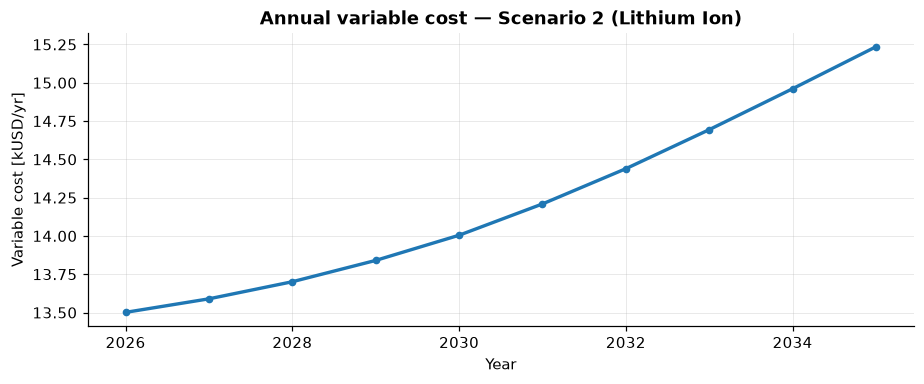
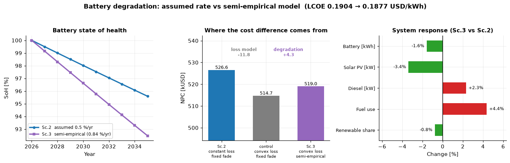

# Technology Choice

*Scenarios 1–3 · constant demand · off-grid · single scenario*

We begin with the simplest set-up and use it to make a point that recurs throughout energy
planning: **the cheapest component does not necessarily give the cheapest system.**

## Scenario 1 — Baseline (lead-acid)

The reference configuration is an off-grid hybrid mini-grid with **solar PV, a diesel
generator, and a lead-acid battery**. Electricity demand is held constant across the 10-year
horizon, and the system is sized in a single upfront installation.

MicroGridsPy sizes the least-cost system as:

| Quantity | Value |
|---|--:|
| Solar PV | **302 kW** |
| Battery (lead-acid) | **1332 kWh** |
| Diesel generator | **26 kW** |
| Renewable share | **91.6 %** |
| Net Present Cost | **618 kUSD** |
| LCOE | **0.223 USD/kWh** |

Even in this simple set-up the system is strongly renewable, with virtually no curtailment.
The diesel generator still plays an important role, covering the hours when solar production
and demand do not align. This baseline is the reference point for everything that follows.

### Economic dynamics

Because demand and the system configuration are constant, annual cash flows are relatively
stable. The one visible dynamic is **battery degradation**: as storage performance slowly
declines, the diesel generator must run a little more to compensate, so variable cost creeps
up year on year. When the lead-acid battery reaches the end of its 8-year life and is
**replaced**, storage performance is restored and the cost drops sharply — the sawtooth below.

*Annual variable cost rises with degradation, then falls when the lead-acid battery is
replaced (year 8, 2034).*

## Scenario 2 — Lithium-ion

In the second run we keep everything identical but change **one** technology: the battery is
now **lithium-ion** instead of lead-acid.

At first glance lead-acid looks more attractive — its capital cost per kWh is lower (200 vs.
300 USD/kWh). But MicroGridsPy compares technologies at the **system level**, accounting not
only for capital cost but also for efficiency, usable depth of discharge, lifetime, and
degradation. Lithium-ion offers higher round-trip efficiency (0.93 vs. 0.86), a deeper usable
window (80 % vs. 50 % DoD), and a longer life (10 vs. 8 years).

The optimal system changes accordingly:

| Quantity | Baseline (lead-acid) | Lithium-ion | Change |
|---|--:|--:|--:|
| Solar PV | 302 kW | 281 kW | −7 % |
| Battery | 1332 kWh | 795 kWh | −40 % |
| Diesel generator | 26 kW | 26 kW | ≈ 0 |
| Net Present Cost | 618 kUSD | **527 kUSD** | **−14.8 %** |
| LCOE | 0.223 USD/kWh | **0.190 USD/kWh** | **−14.8 %** |

Thanks to the higher performance of lithium-ion, the model installs far **less** storage
(and slightly less PV) while keeping diesel backup almost unchanged — and, despite the higher
unit price, both Net Present Cost and LCOE fall by about **15 %**.

*With a 10-year lithium-ion battery there is no mid-horizon replacement, so the sawtooth of
[Scenario 1](#scenario-1-baseline-lead-acid) disappears: variable cost simply creeps up as
capacity fades.*

!!! tip "The lesson"
    A cheaper component does not necessarily lead to a cheaper system. Technology choices
    should be evaluated at the **system level**, not by comparing component prices in
    isolation. The same logic extends to comparing renewable technologies, storage chemistries,
    or backup options within MicroGridsPy.

Because it is the least-cost storage choice, the **lithium-ion** configuration becomes the
reference system for all subsequent scenarios.

## Scenario 3 — Modelling battery ageing instead of assuming it

Scenarios 1 and 2 both describe battery ageing with a single number: capacity fades by a
fixed **0.5 % per year**, no matter how the battery is actually used. That is the common
simplification, and it is convenient — but a battery that sits idle and a battery that is
deeply cycled every day do not age at the same rate.

This scenario keeps the lithium-ion system unchanged and replaces that assumption with
MicroGridsPy's **semi-empirical degradation model**, which splits ageing into two physical
mechanisms:

- **calendar fade** — time-based, driven by temperature;
- **cycle fade** — throughput-based, priced per kWh moved and **convex in depth of
  discharge**, so deep cycles cost more than shallow ones.

Both coefficients are temperature-dependent, so the model needs an ambient temperature
series for the site (see [the case study](case-study.md#ambient-temperature)). The
formulation stays linear: the depth dependence is represented by discretising the usable
state-of-charge window into bands with increasing marginal cost.

### What the physics says

The result contradicts the assumption in an instructive way:

*Left: the assumed 0.5 %/yr decay against the modelled state of health. Centre: where the
cost difference comes from. Right: how the design and operation respond.*

At Kalobeyei the battery is cycled essentially every day, so **cycle fade dominates**.
Calendar ageing at this site's temperatures is only about **0.05 %/yr** — ten times *lower*
than the assumed rate — but the cycling penalty more than makes up for it. The battery ends
the 10-year horizon at **92.5 % state of health**, an average of **0.84 %/yr**:

| | Scenario 2 (assumed) | Scenario 3 (modelled) |
|---|--:|--:|
| Calendar fade | — | 0.05 %/yr |
| Effective total fade | 0.50 %/yr | **0.84 %/yr** |
| State of health in 2035 | 95.6 % | **92.5 %** |

So the conventional 0.5 %/yr figure is **optimistic** for a daily-cycling off-grid mini-grid.

### How the system responds

Facing faster ageing, the optimizer leans slightly more on the generator and slightly less on
storage and solar:

| Quantity | Sc. 2 (assumed fade) | Sc. 3 (modelled fade) | Change |
|---|--:|--:|--:|
| Solar PV | 281 kW | 271 kW | −3.4 % |
| Battery | 795 kWh | 782 kWh | −1.6 % |
| Diesel generator | 26 kW | 27 kW | +2.3 % |
| Fuel consumption | 109 366 | 114 131 | **+4.4 %** |
| Renewable share | 91.2 % | 90.5 % | −0.7 pts |
| Net Present Cost | 526.6 kUSD | 519.0 kUSD | −1.4 % |
| LCOE | 0.190 USD/kWh | 0.188 USD/kWh | −1.4 % |

!!! warning "Read the cost difference carefully"
    Scenario 3 looks **cheaper** than scenario 2, but that saving does **not** come from the
    degradation model. Enabling cycle fade also requires the power-dependent
    **convex battery loss model**, so two things change at once.

    Running the same system with the convex loss model but the *old* fixed fade rate isolates
    them:

    | Configuration | NPC |
    |---|--:|
    | Sc. 2 — constant-efficiency loss, fixed fade | 526.6 kUSD |
    | control — convex loss, fixed fade | 514.7 kUSD |
    | Sc. 3 — convex loss, semi-empirical fade | 519.0 kUSD |

    The more accurate loss model is worth **−11.8 kUSD**; the degradation model on its own
    *adds* **+4.3 kUSD**. Modelling ageing physically makes the system **more** expensive, as
    the faster fade implies — the net saving is entirely due to the loss model. The control
    run is scenario 3 with `cycle_fade_enabled: false`.

!!! tip "The lesson"
    A fixed degradation rate is a modelling **assumption**, not a property of the battery.
    Whether it is conservative or optimistic depends on how the battery ends up being used —
    which is itself an output of the optimization. Where storage cycles hard, as in most
    off-grid mini-grids, a usage- and temperature-aware model gives a materially different
    picture of ageing, fuel use, and renewable share.

Next, we let demand grow — see [Planning for Growth](planning-for-growth.md).
