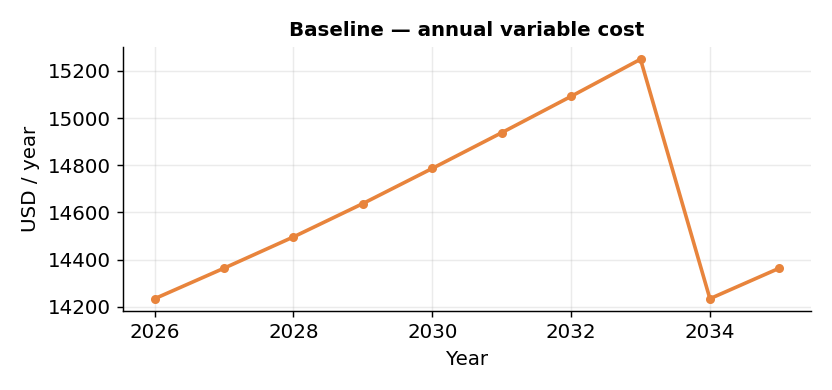

# Technology Choice

*Scenarios 1–2 · constant demand · off-grid · single scenario*

We begin with the simplest set-up and use it to make a point that recurs throughout energy
planning: **the cheapest component does not necessarily give the cheapest system.**

## Scenario 1 — Baseline (lead-acid)

The reference configuration is an off-grid hybrid mini-grid with **solar PV, a diesel
generator, and a lead-acid battery**. Electricity demand is held constant across the 10-year
horizon, and the system is sized in a single upfront installation.

MicroGridsPy sizes the least-cost system as:

| Quantity | Value |
|---|--:|
| Solar PV | **302 kW** |
| Battery (lead-acid) | **1332 kWh** |
| Diesel generator | **26 kW** |
| Renewable share | **91.6 %** |
| Net Present Cost | **618 kUSD** |
| LCOE | **0.223 USD/kWh** |

Even in this simple set-up the system is strongly renewable, with virtually no curtailment.
The diesel generator still plays an important role, covering the hours when solar production
and demand do not align. This baseline is the reference point for everything that follows.

### Economic dynamics

Because demand and the system configuration are constant, annual cash flows are relatively
stable. The one visible dynamic is **battery degradation**: as storage performance slowly
declines, the diesel generator must run a little more to compensate, so variable cost creeps
up year on year. When the lead-acid battery reaches the end of its 8-year life and is
**replaced**, storage performance is restored and the cost drops sharply — the sawtooth below.

*Annual variable cost rises with degradation, then falls when the lead-acid battery is
replaced (year 8, 2034).*

## Scenario 2 — Lithium-ion

In the second run we keep everything identical but change **one** technology: the battery is
now **lithium-ion** instead of lead-acid.

At first glance lead-acid looks more attractive — its capital cost per kWh is lower (200 vs.
300 USD/kWh). But MicroGridsPy compares technologies at the **system level**, accounting not
only for capital cost but also for efficiency, usable depth of discharge, lifetime, and
degradation. Lithium-ion offers higher round-trip efficiency (0.93 vs. 0.86), a deeper usable
window (80 % vs. 50 % DoD), and a longer life (10 vs. 8 years).

The optimal system changes accordingly:

| Quantity | Baseline (lead-acid) | Lithium-ion | Change |
|---|--:|--:|--:|
| Solar PV | 302 kW | 281 kW | −7 % |
| Battery | 1332 kWh | 795 kWh | −40 % |
| Diesel generator | 26 kW | 26 kW | ≈ 0 |
| Net Present Cost | 618 kUSD | **527 kUSD** | **−14.8 %** |
| LCOE | 0.223 USD/kWh | **0.190 USD/kWh** | **−14.8 %** |

Thanks to the higher performance of lithium-ion, the model installs far **less** storage
(and slightly less PV) while keeping diesel backup almost unchanged — and, despite the higher
unit price, both Net Present Cost and LCOE fall by about **15 %**.

!!! tip "The lesson"
    A cheaper component does not necessarily lead to a cheaper system. Technology choices
    should be evaluated at the **system level**, not by comparing component prices in
    isolation. The same logic extends to comparing renewable technologies, storage chemistries,
    or backup options within MicroGridsPy.

Because it is the least-cost storage choice, the **lithium-ion** configuration becomes the
reference system for all subsequent scenarios. Next, we let demand grow — see
[Planning for Growth](planning-for-growth.md).
