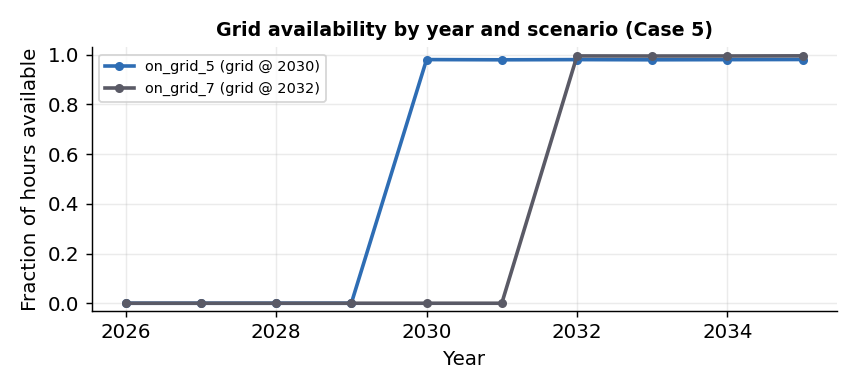
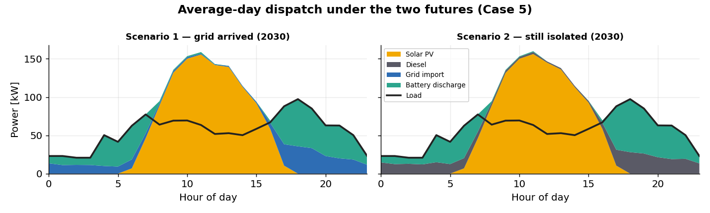
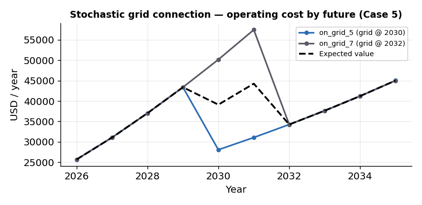
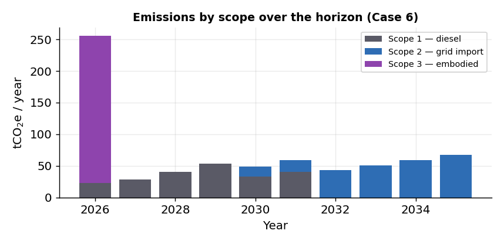

# Uncertainty & Externalities

*Scenarios 5–6 · demand grows +5 %/year · on-grid · two futures*

The previous scenarios assumed the future was known. These two relax that assumption. First
we let the **timing and reliability of a future grid connection** be uncertain, using the
stochastic formulation of MicroGridsPy. Then we internalize an environmental **externality**
by pricing carbon emissions inside the objective.

## Scenario 5 — Stochastic grid connection

The demand trajectory is the same 5 %/year growth as before, but the future context of the
mini-grid becomes **uncertain**. The model considers **two equally probable futures**:

- **Scenario 1 (`on_grid_5`)** — the national grid arrives in **2030**;
- **Scenario 2 (`on_grid_7`)** — the grid arrives later, in **2032**.

Crucially, the grid is **not** assumed to be perfectly reliable. Availability is represented
hour by hour, with outages that gradually diminish as service quality improves. The earlier
connection (`on_grid_5`) starts less reliable (more, longer outages) than the later one.

*Fraction of hours the grid is available, by year. Before the connection year availability is
zero; afterwards it is high but imperfect, reflecting the modelled outage process (see the
[grid-availability methodology](../methodology/grid.md#grid-availability-simulation)).*

This is a **two-stage stochastic** problem with recourse: MicroGridsPy chooses **one** system design
(shared across both futures) but lets **operation adapt** to each future separately. The
dispatch makes the difference tangible — in 2030, the early-connection future can already
import grid electricity in the evening, while the late-connection future still runs as an
isolated mini-grid and covers the evening peak with diesel and storage.

*Average-day dispatch in 2030. Left: grid has arrived — evening load is partly met by grid
import (blue). Right: still isolated — the evening peak is met by battery discharge and
diesel.*

Because the system no longer has to rely entirely on local generation and storage for the
whole horizon, the expected economics improve relative to the off-grid
[capacity-expansion case](planning-for-growth.md#scenario-4-capacity-expansion):

| Quantity | Off-grid (Sc. 4) | Stochastic grid (Sc. 5) | Change |
|---|--:|--:|--:|
| Expected Net Present Cost | 664 kUSD | 602 kUSD | **−9.3 %** |
| Expected LCOE | 0.196 USD/kWh | 0.178 USD/kWh | **−9.3 %** |
| Upfront investment (present) | 832 kUSD | 654 kUSD | −21 % |
| Solar PV | 386 kW | 285 kW | −26 % |

*Operating cost for each of the two futures, and the dashed **expected value** weighted by
their probabilities. Each future has a different cost path — stochastic planning finds a
single design that performs well across both.*

!!! tip "The lesson"
    Rather than optimizing for one assumed future, the stochastic formulation identifies a
    design that performs well **across multiple possible outcomes**. Here the uncertainty
    concerns grid-connection timing and reliability, but the same approach represents
    uncertainty in demand growth, renewable resources, fuel prices, or technology costs.

## Scenario 6 — Carbon cost

The final scenario keeps the same two-future grid structure but adds an environmental signal:
**carbon costs are included directly in the objective function**. Emissions are priced at
**0.1 USD/kgCO₂e** and cover three scopes:

- **Scope 1** — direct emissions from local diesel generation;
- **Scope 2** — indirect emissions from imported grid electricity (grid emission factor
  0.35 kgCO₂e/kWh);
- **Scope 3** — embodied emissions from manufacturing and installing the components.

With emissions priced, the model **shifts toward a cleaner configuration**: it installs more
solar PV and runs the diesel generator less.

| Quantity | No carbon price (Sc. 5) | Carbon cost (Sc. 6) | Change |
|---|--:|--:|--:|
| Solar PV | 285 kW | 300 kW | +6 % |
| Diesel generator | 39 kW | 38 kW | −3 % |
| Fuel consumption | 100 000 L | 82 000 L | −19 % |
| Renewable share | 78.4 % | 81.1 % | +3 pts |
| Expected Net Present Cost | 602 kUSD | 638 kUSD | **+6.0 %** |
| Expected LCOE | 0.178 USD/kWh | 0.189 USD/kWh | **+6.1 %** |
| Reported emissions | — | 706 tCO₂e | — |

Pricing carbon raises expected NPC and LCOE by about **6 %**, but the model responds by
building a more renewable system that reduces the emissions it has to pay for. The emissions
themselves are now an explicit output, resolved by scope and over time.

*Emissions by scope and year. **Scope 3** (embodied) is concentrated at the start, when
components are installed; **Scope 1** (diesel) dominates the early off-grid years; **Scope 2**
(grid import) appears and grows once the grid connects.*

!!! tip "The lesson"
    Environmental impacts need not be evaluated only *after* optimization. By putting a price
    on emissions inside the objective, MicroGridsPy lets environmental considerations
    **actively shape the system design** — making the trade-off between cost and emissions
    transparent rather than implicit.

## Where to go next

These six scenarios show how progressively richer assumptions — technology, growth, staging,
uncertainty, externalities — change the least-cost design of the same mini-grid. To reproduce
or extend them, start from the [reproducibility mapping](index.md#reproducibility), and see
the [Methodology](../methodology/overview.md) for the equations behind each feature and the
[User Guide](../user-guide/running.md) for the practical workflow.
