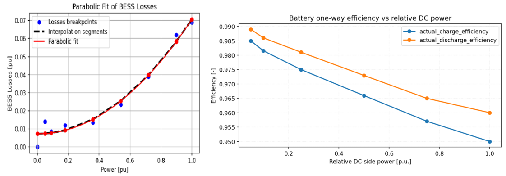
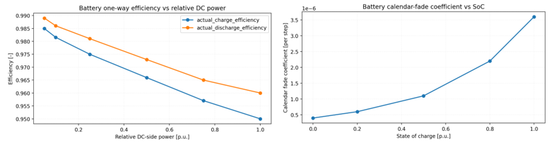

# Battery Storage

MicroGridsPy models the battery energy storage system as an aggregated electrochemical device
described through charging, discharging, and state-of-charge (SOC) dynamics. The model combines
three layers:

- **power limits**, which bound charging and discharging rates;
- **energy-balance constraints**, which govern the evolution of stored energy;
- **usable-capacity constraints**, which limit operation according to nominal or degraded
  available energy.

Two representations are supported: a **constant-efficiency** special case, and an **advanced
convex-loss formulation** where AC-side efficiency varies with power. In the **typical-year**
formulation the battery is a single block operated cyclically over a representative year; in
the **multi-year** formulation, storage investment is **cohort-based**, enabling cohort
availability, inter-year state propagation, and degradation. At hourly resolution
$\Delta t = 1\,\text{h}$, so power (kW) and one-hour energy transfers (kWh) are interchangeable
in the storage balance.

## Constant-efficiency dispatch

The simplest representation uses fixed charge/discharge efficiencies $\eta_{\text{ch}},
\eta_{\text{dis}}$.

### Typical-year formulation

Charging and discharging are bounded by time-to-full parameters:

\[
P^{\text{ch}}_{t,\omega} \le \frac{C^{\text{bat}}}{t_{\text{ch}}}, \qquad
P^{\text{dis}}_{t,\omega} \le \frac{C^{\text{bat}}}{t_{\text{dis}}}
\qquad \forall t,\omega
\]

The state of charge evolves as

\[
\begin{aligned}
\text{SOC}_{0,\omega} &= \text{SOC}_0\, C^{\text{bat}} \\[3pt]
\text{SOC}_{t,\omega} &= \text{SOC}_{t-1,\omega}
+ \eta_{\text{ch}} P^{\text{ch}}_{t-1,\omega}
- \frac{P^{\text{dis}}_{t-1,\omega}}{\eta_{\text{dis}}}
\qquad \forall t=1,\dots,|\mathcal{T}|-1
\end{aligned}
\]

A **cyclic boundary condition** closes the representative year:

\[
\text{SOC}_{|\mathcal{T}|-1,\omega}
+ \eta_{\text{ch}} P^{\text{ch}}_{|\mathcal{T}|-1,\omega}
- \frac{P^{\text{dis}}_{|\mathcal{T}|-1,\omega}}{\eta_{\text{dis}}}
= \text{SOC}_0\, C^{\text{bat}} \qquad \forall\omega
\]

and the SOC is bounded by the depth-of-discharge limit:

\[
(1-\text{DoD})\, C^{\text{bat}} \le \text{SOC}_{t,\omega} \le C^{\text{bat}} \qquad \forall t,\omega
\]

### Multi-year formulation

For each year $y$, scenario $\omega$, and cohort $k$, the power and capacity bounds use the
available cohort capacity $\overline{C}^{\text{bat}}_{y,k}$:

\[
P^{\text{ch}}_{t,y,\omega,k} \le \frac{\overline{C}^{\text{bat}}_{y,k}}{t_{\text{ch}}}, \qquad
P^{\text{dis}}_{t,y,\omega,k} \le \frac{\overline{C}^{\text{bat}}_{y,k}}{t_{\text{dis}}}
\]

\[
(1-\text{DoD})\,\overline{C}^{\text{bat}}_{y,k} \le \text{SOC}_{t,y,\omega,k} \le \overline{C}^{\text{bat}}_{y,k}
\]

Within each year, SOC follows the same constant-efficiency recursion, indexed by $(y,\omega,k)$.
A key difference from the typical-year case is that the multi-year model does **not** impose a
cyclic yearly boundary: the terminal state of one year is carried forward as the initial state
of the next, unless a cohort is newly installed or replaced.

## Advanced battery loss model

The advanced model replaces the constant one-way efficiencies with an explicit representation
of **power-dependent conversion losses**, recast as an LP-safe **convex piecewise-linear
epigraph**.

The public AC-side variables ($P^{\text{ch}}, P^{\text{dis}}$, and the stored energy SOC) are
complemented by internal DC-side variables: the DC power actually stored/withdrawn
($P^{\text{ch,dc}}, P^{\text{dis,dc}}$) and the conversion losses $L^{\text{ch}}, L^{\text{dis}}$.
The AC/DC balances are

\[
P^{\text{ch}} = P^{\text{ch,dc}} + L^{\text{ch}}, \qquad
P^{\text{dis}} = P^{\text{dis,dc}} - L^{\text{dis}}
\]

so when charging, the AC power drawn exceeds the energy stored, and when discharging, the AC
power delivered is lower than the internal energy withdrawn. With reference powers
$P^{\text{ref,ch}} = C^{\text{bat}}/t_{\text{ch}}$ and $P^{\text{ref,dis}} = C^{\text{bat}}/t_{\text{dis}}$,
the losses satisfy epigraph constraints for each interpolation segment $i$:

\[
\begin{aligned}
L^{\text{ch}}_{t,\omega} &\ge m^{\text{ch}}_i\,P^{\text{ch,dc}}_{t,\omega} + q^{\text{ch}}_i\,P^{\text{ref,ch}} \\[3pt]
L^{\text{dis}}_{t,\omega} &\ge m^{\text{dis}}_i\,P^{\text{dis,dc}}_{t,\omega} + q^{\text{dis}}_i\,P^{\text{ref,dis}}
\end{aligned}
\qquad \forall i,t,\omega
\]

The coefficients $m_i, q_i$ are precomputed from the battery efficiency-curve input, keeping the
optimization **linear and tractable**. Under the advanced model the SOC balance uses the DC-side
flows,

\[
\text{SOC}_{t,\omega} = \text{SOC}_{t-1,\omega} + P^{\text{ch,dc}}_{t-1,\omega} - P^{\text{dis,dc}}_{t-1,\omega}
\]

so the constant-efficiency recursion is a **special case**: when the advanced model is active,
$\eta_{\text{ch}}, \eta_{\text{dis}}$ are no longer used directly and efficiency is captured
through explicit losses.

*Power-dependent battery losses and the resulting one-way efficiency. **Left:** the convex loss
curve approximated through piecewise-linear segments. **Right:** the corresponding charge and
discharge efficiency, which decrease as relative DC-side power increases.*

## Multi-year degradation model

The multi-year implementation includes a hybrid degradation representation combining hourly
operational effects with yearly capacity updates, capturing three ageing mechanisms: **cycle
fade** (from hourly throughput), **calendar fade** (applied yearly as a function of average
SOC), and optional **exogenous annual degradation**. The effective capacity is a **yearly state
variable**, constant within a year and updated at year transitions.

### Available and effective capacity

Two capacity concepts are distinguished. The **available nominal capacity** of a cohort is

\[
\overline{C}^{\text{bat}}_{y,k} = u_k\, C^{\text{bat}}_{\text{nom}}\, a_{y,k}\, g_{y,k}
\]

where $u_k$ is the number of units in cohort $k$, $C^{\text{bat}}_{\text{nom}}$ the nominal
unit capacity, $a_{y,k}$ the activity mask, and $g_{y,k}$ an optional exogenous annual
degradation factor. The **effective usable capacity** $C^{\text{eff}}_{y,\omega,k} \le
\overline{C}^{\text{bat}}_{y,k}$ is the usable energy remaining after endogenous degradation;
it is constant within each year and evolves only across years.

### Cycle and calendar fade

**Cycle fade** is modelled from hourly throughput,

\[
F^{\text{cyc}}_{t,y,\omega,k} = \gamma^{\text{cyc}}\cdot \frac{P^{\text{ch,dc}}_{t,y,\omega,k} + P^{\text{dis,dc}}_{t,y,\omega,k}}{2}
\]

with $\gamma^{\text{cyc}}$ a cycle-degradation coefficient. **Calendar fade** is applied once per
year using the scenario-weighted expected yearly-average SOC, through an epigraph:

\[
F^{\text{cal}}_{y,k} \ge a_{y,k}\, \Delta\tau_{\text{yr}}
\left( m^{\text{cal}}_j\, \overline{\text{SOC}}^{\text{exp}}_{y,k} + q^{\text{cal}}_j\, \overline{C}^{\text{bat}}_{y,k} \right) \quad \forall j
\]

where $m^{\text{cal}}_j, q^{\text{cal}}_j$ define the piecewise-linear calendar-ageing curve.
This captures the empirical observation that prolonged operation at high average SOC
accelerates ageing.

*Inputs to the advanced battery model. **Left:** charge and discharge one-way efficiency versus
relative DC-side power. **Right:** the calendar-fade coefficient as a function of state of charge
— prolonged operation at high SOC accelerates long-term ageing.*

### Year-to-year capacity evolution

Effective capacity carries over between years, minus accumulated degradation,

\[
C^{\text{cont}}_{y,\omega,k} = C^{\text{eff}}_{y-1,\omega,k} - \sum_t F^{\text{cyc}}_{t,y-1,\omega,k} - F^{\text{cal}}_{y-1,k}
\]

while a newly commissioned cohort is reset to $C^{\text{reset}}_{y,k} = \text{SoH}_0\,
\overline{C}^{\text{bat}}_{y,k}$. The implemented transition is an upper bound,

\[
C^{\text{eff}}_{y,\omega,k} \le (1-b_{y,k})\, C^{\text{cont}}_{y,\omega,k} + b_{y,k}\, C^{\text{reset}}_{y,k}
\]

where $b_{y,k}$ marks commissioning years, and a small objective regularization keeps effective
capacity at its largest feasible value. When degradation is enabled, the effective capacity
directly limits both the maximum stored energy and the admissible charge/discharge power (the
power and SOC bounds above use $C^{\text{eff}}_{y,\omega,k}$).

### Configuration logic

| Mode | Behaviour |
|---|---|
| Constant-efficiency | fixed capacity, no endogenous degradation |
| Advanced loss model | convex loss functions, no ageing |
| Cycle-fade | hourly throughput drives degradation (optionally with exogenous annual) |
| Calendar-fade | yearly expected SOC drives degradation (exogenous annual auto-disabled to avoid double counting) |

Endogenous degradation requires the convex loss formulation to be active.

!!! note "Replacement vs. degradation"
    Two mechanisms must be distinguished: **economic replacement**, governed exogenously by the
    battery lifetime and cohort masks, which affects sizing and investment timing; and
    **internal degradation**, which reduces usable capacity within a cohort's life and affects
    dispatch. The current implementation does **not** include an endogenous state-of-health
    decision variable or an end-of-life replacement trigger — replacement timing is imposed
    externally. Users should therefore keep the lifetime, end-of-life SoH threshold, cycle-life,
    calendar-fade, and exogenous degradation assumptions mutually consistent, so batteries are
    neither replaced too early nor operated too long in a heavily degraded state.

!!! info "Future extensions"
    Possible developments include temperature-dependent degradation, efficiency, or capacity
    limits (treatable as exogenous inputs, preserving linearity), and an explicit SoH state with
    replacement decisions linked directly to degradation thresholds.
