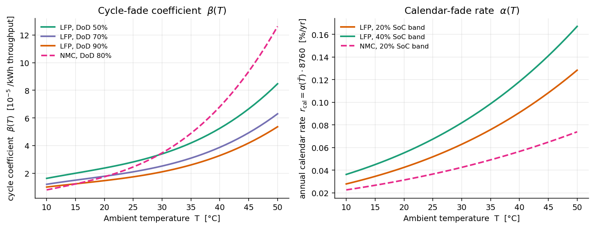
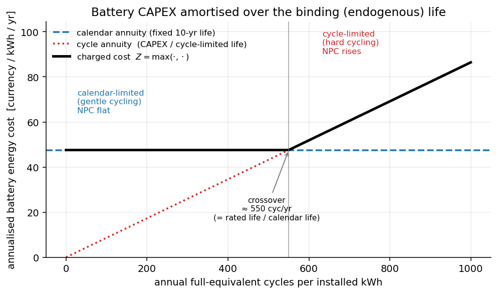

# Battery Storage

MicroGridsPy models the battery energy storage system as an aggregated electrochemical device
described through charging, discharging, and state-of-charge (SOC) dynamics. The model combines
three layers:

- **power limits**, which bound charging and discharging rates;
- **energy-balance constraints**, which govern the evolution of stored energy;
- **usable-capacity constraints**, which limit operation according to nominal or degraded
  available energy.

Two representations are supported: a **constant-efficiency** special case, and an **advanced
convex-loss formulation** where AC-side efficiency varies with power. In the **typical-year**
formulation the battery is a single block operated cyclically over a representative year; in
the **multi-year** formulation, storage investment is **cohort-based**, enabling cohort
availability and inter-year state propagation. **Semi-empirical degradation** is available in
both — priced through a binding-life CAPEX amortisation in the typical-year model, and additionally
tracked as a capacity-fade state in the multi-year model (see
[Battery degradation](#battery-degradation)). At hourly resolution
$\Delta t = 1\,\text{h}$, so power (kW) and one-hour energy transfers (kWh) are interchangeable
in the storage balance.

## Constant-efficiency dispatch

The simplest representation uses fixed charge/discharge efficiencies $\eta_{\text{ch}},
\eta_{\text{dis}}$.

### Typical-year formulation

Charging and discharging are bounded by the installed battery **inverter (converter) power**
$P^{\text{inv}}$, an explicit sizing variable that may optionally be coupled to the installed
energy through a maximum C-rate $c^{\text{rate}}$ ($P^{\text{inv}} \le c^{\text{rate}}\,C^{\text{bat}}$):

\[
P^{\text{ch}}_{t,\omega} \le P^{\text{inv}}, \qquad
P^{\text{dis}}_{t,\omega} \le P^{\text{inv}}
\qquad \forall t,\omega
\]

The state of charge evolves as

\[
\begin{aligned}
\text{SOC}_{0,\omega} &= \text{SOC}_0\, C^{\text{bat}} \\[3pt]
\text{SOC}_{t,\omega} &= \text{SOC}_{t-1,\omega}
+ \eta_{\text{ch}} P^{\text{ch}}_{t-1,\omega}
- \frac{P^{\text{dis}}_{t-1,\omega}}{\eta_{\text{dis}}}
\qquad \forall t=1,\dots,|\mathcal{T}|-1
\end{aligned}
\]

A **cyclic boundary condition** closes the representative year:

\[
\text{SOC}_{|\mathcal{T}|-1,\omega}
+ \eta_{\text{ch}} P^{\text{ch}}_{|\mathcal{T}|-1,\omega}
- \frac{P^{\text{dis}}_{|\mathcal{T}|-1,\omega}}{\eta_{\text{dis}}}
= \text{SOC}_0\, C^{\text{bat}} \qquad \forall\omega
\]

and the SOC is bounded by the depth-of-discharge limit:

\[
(1-\text{DoD})\, C^{\text{bat}} \le \text{SOC}_{t,\omega} \le C^{\text{bat}} \qquad \forall t,\omega
\]

### Multi-year formulation

For each year $y$, scenario $\omega$, and cohort $k$, charge/discharge power is bounded by the
active installed inverter power $P^{\text{inv}}$, while the SOC is bounded by the available cohort
energy capacity $\overline{C}^{\text{bat}}_{y,k}$:

\[
P^{\text{ch}}_{t,y,\omega,k} \le P^{\text{inv}}, \qquad
P^{\text{dis}}_{t,y,\omega,k} \le P^{\text{inv}}
\]

\[
(1-\text{DoD})\,\overline{C}^{\text{bat}}_{y,k} \le \text{SOC}_{t,y,\omega,k} \le \overline{C}^{\text{bat}}_{y,k}
\]

Within each year, SOC follows the same constant-efficiency recursion, indexed by $(y,\omega,k)$.
A key difference from the typical-year case is that the multi-year model does **not** impose a
cyclic yearly boundary: the terminal state of one year is carried forward as the initial state
of the next, unless a cohort is newly installed or replaced.

## Advanced battery loss model

The advanced model replaces the constant one-way efficiencies with an explicit representation
of **power-dependent conversion losses**, recast as an LP-safe **convex piecewise-linear
epigraph**.

The public AC-side variables ($P^{\text{ch}}, P^{\text{dis}}$, and the stored energy SOC) are
complemented by internal DC-side variables: the DC power actually stored/withdrawn
($P^{\text{ch,dc}}, P^{\text{dis,dc}}$) and the conversion losses $L^{\text{ch}}, L^{\text{dis}}$.
The AC/DC balances are

\[
P^{\text{ch}} = P^{\text{ch,dc}} + L^{\text{ch}}, \qquad
P^{\text{dis}} = P^{\text{dis,dc}} - L^{\text{dis}}
\]

so when charging, the AC power drawn exceeds the energy stored, and when discharging, the AC
power delivered is lower than the internal energy withdrawn. The curve is normalized on the
installed inverter power, so both reference powers equal the inverter design variable,
$P^{\text{ref,ch}} = P^{\text{ref,dis}} = P^{\text{inv}}$, and the losses satisfy epigraph
constraints for each interpolation segment $i$:

\[
\begin{aligned}
L^{\text{ch}}_{t,\omega} &\ge m^{\text{ch}}_i\,P^{\text{ch,dc}}_{t,\omega} + q^{\text{ch}}_i\,P^{\text{ref,ch}} \\[3pt]
L^{\text{dis}}_{t,\omega} &\ge m^{\text{dis}}_i\,P^{\text{dis,dc}}_{t,\omega} + q^{\text{dis}}_i\,P^{\text{ref,dis}}
\end{aligned}
\qquad \forall i,t,\omega
\]

The coefficients $m_i, q_i$ are precomputed from the battery efficiency-curve input, keeping the
optimization **linear and tractable**. The curve is fit through the user's sampled operating
points only — it is **not** forced through the origin — so the lowest segment can carry a
positive intercept $q_i\,P^{\text{inv}}$ representing a **no-load / standby loss**. This is what
lets the model express a physically realistic **peaked** efficiency: efficiency is best near an
intermediate power and falls at both **very low power** (the fixed standby loss dominates a small
throughput) and **full power** (conversion and resistive losses grow). A curve anchored at the
origin would have $L(0)=0$ and could only ever be monotonically *more* efficient at low power,
which would make the power-dependent model uniformly cheaper than the constant baseline. The
system boundary is **AC-to-AC** (the inverter/converter plus the cell path), so the one-way
efficiencies represent the full round-trip conversion of a modern LFP + hybrid-inverter system.

Under the advanced model the SOC balance uses the DC-side flows,

\[
\text{SOC}_{t,\omega} = \text{SOC}_{t-1,\omega} + P^{\text{ch,dc}}_{t-1,\omega} - P^{\text{dis,dc}}_{t-1,\omega}
\]

so the constant-efficiency recursion is a **special case**: when the advanced model is active,
$\eta_{\text{ch}}, \eta_{\text{dis}}$ are no longer used directly and efficiency is captured
through explicit losses.

*Power-dependent battery losses and the resulting one-way efficiency. **Left:** the convex loss
curve, with a positive no-load (standby) intercept, approximated through piecewise-linear
segments. **Right:** the corresponding charge and discharge efficiency — **peaked** at an
intermediate power and lower at both very low power (standby-dominated) and full power
(conversion/resistive losses).*

## Battery degradation

Battery ageing is represented with a **linearised semi-empirical model**. The idea (after
[Andrade's decomposition](#references)) is to collapse a physics-grade electro-thermal + ageing
simulation into a single linear recursion on usable energy capacity,

\[
E_t = E_{t-1} \;-\; \alpha\, E^{\text{B}} \;-\; \beta\, P^{\text{BE}}_t
\]

where $E^{\text{B}}$ is the nameplate energy, $P^{\text{BE}}_t$ the energy exchanged in hour $t$,
$\alpha$ the **calendar** coefficient (always active, time-based) and $\beta$ the **cycle**
coefficient (active only when power flows, use-based). The strength of the approach is that
$\alpha$ and $\beta$ are **pre-fitted, exogenous coefficients**: they already carry the dominant
stress factors — **temperature**, **depth-of-discharge** and **chemistry** — yet the optimisation
sees them as constants, so it stays linear.

### Semi-empirical coefficients $\alpha(T)$ and $\beta(T)$

Both coefficients are cubic polynomials in a scaled ambient temperature $y = T_{\text{env}}/10$:

\[
\alpha_{\text{hour}}(T) = c_1 y^3 + c_2 y^2 + c_3 y + c_4,
\qquad
\beta_{\text{hour}}(T) = \big(d_1 y^3 + d_2 y^2 + d_3 y + d_4\big)\cdot \frac{N_{\text{ref}}}{N_{\text{user}}}
\]

The **shape** (the fitted $c_i, d_i$) is built in, selected by **chemistry** ∈ {LFP, NMC,
lead-acid} and by stress band: $\beta$ per **DoD band** (50–90 % for Li-ion), $\alpha$ per
**SoC band** chosen from the DoD (deep discharge → high-SoC storage → 20 % band; shallow →
40 % band). Lead-acid uses a single temperature-independent $\beta$ in $z = 10\,\text{DoD} - 2$.
The **magnitude** is user-scalable through a parameter you already provide — the **rated cycle
life** $N_{\text{user}}$ — via the ratio $N_{\text{ref}}/N_{\text{user}}$, which ports the
validated curve to a battery of any cycle life without re-fitting. This is the same
"fixed shape × user scale" pattern used by the generator partial-load curve.

*Semi-empirical coefficients versus ambient temperature. **Left:** the cycle coefficient
$\beta(T)$ — rising with temperature, and depth- and chemistry-dependent. **Right:** the calendar
coefficient expressed as an annual rate $\alpha(\bar T)\cdot 8760$ — rising with temperature and
higher at higher average SoC. Both are evaluated offline, so the optimisation stays linear.*

These are driven by two inputs, required only when cycle-fade degradation is enabled:

- `ambient_temperature.csv` — an hourly ambient-temperature series (°C), with the same
  scenario/year layout as `load_demand.csv`;
- `battery.technical.chemistry` — one of `LFP`, `NMC`, `lead_acid`;

together with `battery.technical.depth_of_discharge` (sets the band), the rated
`cycle_lifetime_to_eol_cycles`, and the state-of-health span `initial_soh` / `end_of_life_soh`.

### Typical-year: amortisation over the binding life

The steady-state typical-year model has no multi-year capacity state, so degradation is purely an
**economic** effect. It must stay consistent with the objective's annuity convention: every asset's
CAPEX is turned into a level annual charge $\text{CRF}(\text{wacc}, L)\cdot\text{CAPEX}$ (cost of
capital included) and paid every year, which already prices replacement over the *calendar* life —
so degradation acts on the **effective lifetime**, not as a separate charge. The battery energy
CAPEX is therefore recovered by the **larger** of a calendar annuity and a cycle annuity (i.e.
amortised over the shorter of the two lives), via a per-scenario epigraph $Z_\omega$:

\[
\begin{aligned}
Z_\omega &\ge \text{CRF}(\text{wacc}, L^{\text{cal}})\,\text{CAPEX}\; C^{\text{bat}} && \text{(calendar annuity)}\\[3pt]
Z_\omega &\ge c^{\text{repl}}\,\varphi \sum_t \beta_{t,\omega}\big(P^{\text{ch}}_{t,\omega}+P^{\text{dis}}_{t,\omega}\big) && \text{(cycle annuity)}
\end{aligned}
\qquad
c^{\text{repl}} = \frac{\text{CAPEX}}{\text{SoH}_0-\text{SoH}_{\text{eol}}},\;\;
\varphi = \text{CRF}(\text{wacc}, L^{\text{cal}})\,L^{\text{cal}}
\]

Minimising $\sum_\omega w_\omega Z_\omega$ drives $Z$ to the maximum of the two, so the battery is
charged **CAPEX ÷ min(calendar, cycle-limited) life**. When cycling is gentle the calendar limit
binds and degradation adds nothing; when it is hard enough to shorten the life below the calendar
value the cycle limit binds and the cost rises. Hotter operation raises $\beta(T)$ and so brings the
crossover forward. This mirrors the multi-year treatment below (same $\varphi$ calibration and the
same flat-then-rising cost envelope shown in the replacement-cost figure) but needs neither a
capacity state nor the convex-loss model.

### Multi-year: capacity-fade state

The dynamic multi-year model tracks an explicit **yearly usable-capacity state** per scenario and
investment cohort. The **available nominal capacity** of a cohort is

\[
\overline{C}^{\text{bat}}_{y,k} = u_k\, C^{\text{bat}}_{\text{nom}}\, a_{y,k}\, g_{y,k},
\]

with $u_k$ units, activity mask $a_{y,k}$, and a **calendar-fade factor** $g_{y,k}$ (below). The
**effective usable capacity** $C^{\text{eff}}_{y,\omega,k}\le \overline{C}^{\text{bat}}_{y,k}$ is
the energy left after cycle fade; it is constant within a year and evolves across years.

**Cycle fade** is the annual sum of $\beta(T)$ times the DC-side energy exchanged (both directions,
matching $\beta$'s calibration of $2\,\text{DoD}$ throughput per full cycle):

\[
F^{\text{cyc}}_{y,\omega,k} = \sum_t \beta_{t,y,\omega}\,
\big(P^{\text{ch,dc}}_{t,y,\omega,k} + P^{\text{dis,dc}}_{t,y,\omega,k}\big)
\]

**Calendar fade** is applied through the exogenous factor $g_{y,k}$, whose **rate is driven by
$\alpha(T)$** rather than a flat user %/yr:

\[
r^{\text{cal}}_{y} = \alpha_{\text{hour}}(\bar T_y)\cdot 8760,
\qquad
g_{y,k} = \prod_{j=\text{commission}}^{\,y-1}\big(1 - r^{\text{cal}}_{j}\big)
\]

where $\bar T_y$ is the annual-mean ambient temperature. The product accumulates over the years a
cohort has lived and restarts at each replacement; for a constant temperature it reduces to
$(1-r^{\text{cal}})^{\text{age}-1}$.

The state evolves by carrying capacity forward minus that year's cycle fade, resetting a newly
commissioned cohort to $C^{\text{reset}}_{y,k} = \text{SoH}_0\,\overline{C}^{\text{bat}}_{y,k}$:

\[
C^{\text{eff}}_{y,\omega,k} \;\;\{\le\;\text{or}\;=\}\;\;
\big(C^{\text{eff}}_{y-1,\omega,k} - F^{\text{cyc}}_{y-1,\omega,k}\big)\,(1-b_{y,k}) + C^{\text{reset}}_{y,k}\, b_{y,k}
\]

The link is an exact **equality** when the availability ceiling does not decline (no calendar rate),
and an inequality (take the smaller of the carried state and the declining ceiling) otherwise. The
effective capacity then limits the **stored energy**, so fade shrinks the usable SOC window while
charge/discharge **power** stays bounded by the inverter:

\[
(1-\text{DoD})\,C^{\text{eff}}_{y,\omega,k} \le \text{SOC}_{t,y,\omega,k} \le C^{\text{eff}}_{y,\omega,k}
\]

The reported state of health $\text{SoH} = C^{\text{eff}}/\overline{C}^{\text{bat}}$ is
reconstructed from this physical recursion.

### Multi-year: replacement economics — amortisation over the binding life

MicroGridsPy costs every asset as a **level annuity** (CRF × CAPEX paid each active year, cost of
capital included), which is a pay-as-you-go rental: it needs no salvage term and already embeds
replacement every *calendar* lifetime. Degradation must therefore act on the **effective lifetime**
— not as a second, parallel wear charge (which would double-count the replacement already priced by
the annuity). The battery **energy** CAPEX is recovered by amortising it over the **binding life**,
i.e. the shorter of the calendar life and the cycle-limited life. This is written as a linear
**max-of-two-annuities** epigraph on a per-cohort cost $Z_{y,\omega,k}$:

\[
\begin{aligned}
Z_{y,\omega,k} &\ge \underbrace{u_k\,C^{\text{bat}}_{\text{nom}}\,\text{CAPEX}\,\cdot \text{CRF}(\text{wacc}, L^{\text{cal}})\, a_{y,k}}_{\text{calendar annuity}} \\[4pt]
Z_{y,\omega,k} &\ge \underbrace{c^{\text{repl}}\,\varphi\; F^{\text{cyc}}_{y,\omega,k}}_{\text{cycle annuity}},
\qquad \varphi = \text{CRF}(\text{wacc}, L^{\text{cal}})\cdot L^{\text{cal}}
\end{aligned}
\]

Minimising $\sum_y \text{disc}_y \sum_\omega w_\omega \sum_k Z_{y,\omega,k}$ drives $Z$ to the
**maximum** of the two, which equals the CAPEX amortised over $\min(L^{\text{cal}},
L^{\text{cyc}})$ — the effective (economic = technical) lifetime. The financing gross-up $\varphi$
is calibrated so the two bounds meet exactly at the crossover (cycle life = calendar life), making
the switch continuous; $\varphi = 1$ when WACC = 0. The battery **inverter** CAPEX stays
calendar-amortised.

*Amortising battery energy CAPEX over the binding life. Below the crossover (gentle cycling) the
**calendar** limit binds and the charged cost is flat — degradation adds nothing beyond what the
ordinary annuity already prices. Above it (hard cycling) the **cycle** limit binds and the cost
rises, so cycling is penalised only when it actually shortens the battery's life. The optimiser can
respond by oversizing storage to cycle each unit more gently and push the cycle life back toward the
calendar limit.*

### Configuration & inputs

| Switch | Behaviour |
|---|---|
| Efficiency model | constant round-trip efficiency, or power-dependent convex losses (no ageing on its own) |
| Cycle fade (`cycle_fade_enabled`) | semi-empirical $\beta(T)$: binding-life CAPEX amortisation (both formulations), plus a capacity-fade state in the multi-year model |
| Calendar fade | in multi-year, the $\alpha(T)$-driven annual rate $r^{\text{cal}}_y$ on the availability factor |

Endogenous cycle fade in the **multi-year** model requires the convex-loss efficiency model
(throughput is defined on the internal DC-side powers); the typical-year cost does not.
When cycle fade is enabled, provide `ambient_temperature.csv`, `battery.technical.chemistry`,
`cycle_lifetime_to_eol_cycles`, and `end_of_life_soh`.

!!! info "Future extensions"
    Discrete **state-of-health-triggered replacement** (replace exactly when SoH reaches
    end-of-life) is the rigorous form of the binding-life idea, but it introduces integer
    replacement decisions and a salvage term, so the linear max-of-annuities is used instead.
    Other possible additions: power fade / SoH-dependent power derating, and representative-day
    clustering to speed up the full 8760 × Y degradation solve.

### References

The decomposition and the fitted $\alpha$/$\beta$ coefficients follow S. Andrade, *Battery
Degradation Modelling for Off-Grid Energy System Sizing: Methodology and Case Study in the African
Context* (MSc dissertation, Politecnico di Milano / FCUL, 2023), which calibrates the linear
recursion against a physics-based electro-thermal + semi-empirical reference model.
