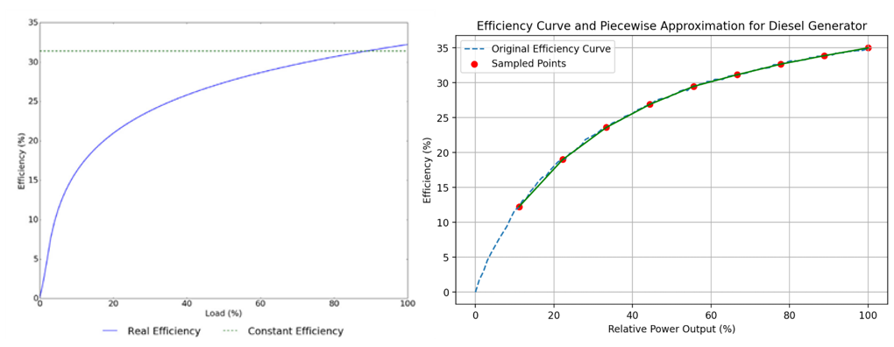

# Backup Generators

MicroGridsPy models dispatchable backup generation through a single generator technology
representing the backup unit of the mini-grid, described by a unit-based sizing variable and an
hourly production variable. Fuel consumption is modelled explicitly and linked to electrical
output through either a **nominal-efficiency relationship** or a **partial-load model** that
combines an affine Willans fuel line with a clustered unit-commitment variable.

The same structure is used in both modes; in the **multi-year** formulation, generator
investment and operation are **cohort-based**, so production limits and fuel relations are
indexed by year $y$ and step $k$. At hourly resolution $\Delta t = 1\,\text{h}$, generation in
kWh over one step equals average power in kW.

## Installed capacity and production limit

### Typical-year formulation

The generator is sized in discrete units $N^{\text{gen}}$, each with nominal capacity
$P^{\text{gen}}$ (kW), for a total $C^{\text{gen}} = N^{\text{gen}} \cdot P^{\text{gen}}$.
Hourly production is bounded by installed capacity, with an optional maximum-installable bound:

\[
E^{\text{gen}}_{t,\omega} \le N^{\text{gen}} \cdot P^{\text{gen}} \qquad \forall t,\omega,
\qquad\qquad
N^{\text{gen}} \cdot P^{\text{gen}} \le \overline{C}^{\text{gen}}
\]

### Multi-year formulation

Generator investment is cohort-based. Each step $k$ introduces $N^{\text{gen}}_{k}$ units, with
nominal cohort capacity $C^{\text{gen}}_{k} = N^{\text{gen}}_{k} \cdot P^{\text{gen}}$. The
available cohort capacity in year $y$ is

\[
\widetilde{C}^{\text{gen}}_{y,k} = N^{\text{gen}}_{k}\cdot P^{\text{gen}}\cdot \alpha_{y,k}\cdot \delta_{y,k}
\]

where $\alpha_{y,k}$ is the cohort activity/replacement mask and $\delta_{y,k}$ an optional
exogenous degradation factor. Production is bounded cohort by cohort and aggregated:

\[
E^{\text{gen}}_{t,y,\omega,k} \le \widetilde{C}^{\text{gen}}_{y,k} \qquad \forall t,y,\omega,k,
\qquad\qquad
E^{\text{gen,tot}}_{t,y,\omega} = \sum_k E^{\text{gen}}_{t,y,\omega,k}
\]

The maximum-installable bound applies to the cumulative design:
$\sum_k N^{\text{gen}}_{k} \cdot P^{\text{gen}} \le \overline{C}^{\text{gen}}$.

## Fuel–power relationship (nominal efficiency)

When partial-load modelling is disabled, fuel consumption is linked to output through a constant
nominal efficiency $\eta^{\text{nom}}$ and the fuel lower heating value $\text{LHV}$:

\[
E^{\text{gen}}_{t,\omega} = F_{t,\omega}\cdot \text{LHV}\cdot \eta^{\text{nom}}
\qquad\text{(typical-year)}
\]

\[
E^{\text{gen}}_{t,y,\omega,k} = F_{t,y,\omega,k}\cdot \text{LHV}\cdot \eta^{\text{nom}}
\qquad\text{(multi-year)}
\]

where $F$ is fuel consumption in units consistent with the LHV. The implied specific fuel
consumption is constant over the whole operating range.

## Partial-load efficiency and unit commitment

When partial-load modelling is enabled, efficiency becomes output-dependent. A real diesel
genset burns fuel just to stay running (a **no-load intercept**) plus extra fuel per unit of
output, so specific fuel consumption worsens sharply at low load. This is captured by an
**affine Willans fuel line** paired with a **committed-capacity** variable.

### Willans fuel line

The user-provided efficiency curve gives relative loading points $r_b \in (0,1]$ with
efficiencies $\eta_b$. The implied relative fuel-use is $\phi(r) = r/\eta(r)$, which is fit to the
affine function

\[
\phi(r) = q_0 + q_1\, r
\]

anchored at full load so the datasheet full-load efficiency is preserved exactly
($q_0 + q_1 = 1/\eta^{\text{nom}}$). Here $q_0 \ge 0$ is the relative **no-load fuel use** and
$q_1 > 0$ the **marginal** relative fuel use. Because the origin is handled by the commitment
variable below, the curve is **not** anchored at $(0,0)$ and no convex majorant is needed.

### Committed capacity and unit commitment

A commitment variable $N^{\text{on}}$ counts the generator units **online**, so the online
capacity is $N^{\text{on}} P^{\text{gen}}$. Output is bounded by the online capacity (with an
optional minimum stable load $m \in [0,1)$), the online count cannot exceed the available
capacity, and fuel carries the no-load intercept **per online unit**:

\[
\begin{aligned}
m\, N^{\text{on}}_{t,\omega} P^{\text{gen}} \;\le\; E^{\text{gen}}_{t,\omega} &\;\le\; N^{\text{on}}_{t,\omega} P^{\text{gen}} \\[3pt]
N^{\text{on}}_{t,\omega} P^{\text{gen}} &\;\le\; N^{\text{gen}} P^{\text{gen}} \\[3pt]
F_{t,\omega} &\;\ge\; \frac{q_1}{\text{LHV}}\, E^{\text{gen}}_{t,\omega} + \frac{q_0}{\text{LHV}}\, N^{\text{on}}_{t,\omega} P^{\text{gen}}
\end{aligned}
\qquad \forall t,\omega
\]

Minimising fuel makes the epigraph tight, so idling committed capacity burns the no-load fuel
even at zero output. In the **multi-year** formulation the same relations are written per
cohort $k$, with the online capacity $N^{\text{on}}_{t,y,\omega,k} P^{\text{gen}}$ bounded by the
available (degraded) cohort capacity $\widetilde{C}^{\text{gen}}_{y,k}$.

### Commitment modes

| Mode | $N^{\text{on}}$ | Behaviour |
|---|---|---|
| `off` | — | constant full-load efficiency (nominal relationship) |
| `integer` | integer | whole online units (clustered unit commitment, after Palmintier & Webster). The no-load fuel and the minimum stable load become binding, so the genset refuses sub-minimum loads and pays the part-load penalty |

Clustered integer commitment uses a **single integer per timestep** (per cohort), keeping the
mixed-integer problem far smaller than one binary per unit while still capturing on/off and
minimum-load physics.

*Generator efficiency under the constant and partial-load formulations. **Left:** a real
generator efficiency curve versus the constant-efficiency approximation — real efficiency falls
sharply at low load because of the no-load fuel intercept. **Right:** the sampled efficiency
points used to fit the affine Willans fuel line, which preserves the datasheet full-load
efficiency.*

!!! note "What is and is not modelled"
    The Willans fit preserves the datasheet full-load efficiency and introduces a genuine
    no-load fuel intercept; the input curve is validated at model build (strictly positive
    efficiencies, a non-decreasing implied fuel curve). The `integer` mode adds a minimum stable
    load and true on/off behaviour, but **start-up and shut-down costs and minimum up/down
    times are not yet modelled**. Part-load commitment is a mixed-integer program; over long
    multi-year horizons pair it with representative periods to keep it tractable.
