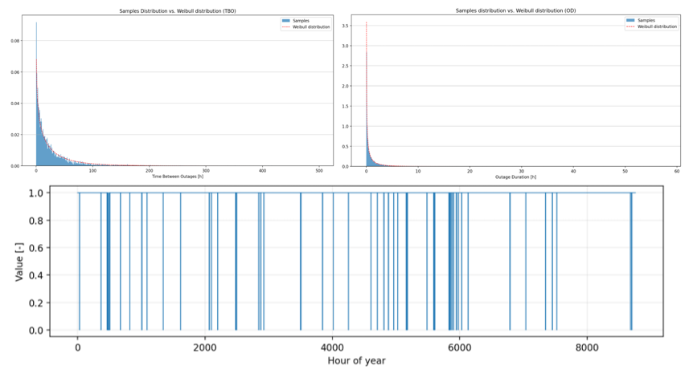

# Grid Connection and Availability

MicroGridsPy can represent a **weakly grid-connected** mini-grid in addition to the fully
isolated off-grid configuration. When grid connection is enabled, the system can import
electricity and, optionally, export surplus. Grid interaction is constrained by the physical
exchange capacity of the interconnection line and a **time-dependent grid-availability matrix**
capturing outages and upstream reliability.

!!! info "Point-of-common-coupling convention"
    Grid import and export variables represent **raw energy exchanged at the point of common
    coupling (PCC)** — the electricity crossing the grid interface *before* internal
    transmission/conversion efficiency is applied. Grid efficiency $\eta^{\text{grid}}$ is
    therefore accounted for in the **energy balance** and in **grid-related emissions**, but
    **not** in the line-capacity constraints.

At hourly resolution $\Delta t = 1\,\text{h}$, line capacity (kW) and per-step exchange (kWh)
coincide. Let $E^{\text{imp}}$ and $E^{\text{exp}}$ be imported/exported electricity at the PCC.
Grid exchange is governed by: the binary availability $A^{\text{grid}}\in\{0,1\}$; the line
capacity $\overline{P}^{\text{grid}}$; the transmission/conversion efficiency
$\eta^{\text{grid}}$; the `allow_export` switch; and, in multi-year, `first_year_connection`.
The relevant dimensions are $(t,\omega)$ for typical-year and $(t,y,\omega)$ for multi-year.

## Grid import and export capacity

Import (and, if enabled, export) is bounded by line capacity and availability. **Typical-year:**

\[
0 \le E^{\text{imp}}_{t,\omega} \le A^{\text{grid}}_{t,\omega}\,\overline{P}^{\text{grid}}, \qquad
0 \le E^{\text{exp}}_{t,\omega} \le A^{\text{grid}}_{t,\omega}\,\overline{P}^{\text{grid}}
\qquad \forall t,\omega
\]

**Multi-year** (with explicit year indexing):

\[
0 \le E^{\text{imp}}_{t,y,\omega} \le A^{\text{grid}}_{t,y,\omega}\,\overline{P}^{\text{grid}}, \qquad
0 \le E^{\text{exp}}_{t,y,\omega} \le A^{\text{grid}}_{t,y,\omega}\,\overline{P}^{\text{grid}}
\qquad \forall t,y,\omega
\]

Exchange is thus possible only when the upstream grid is available and within the rated
interconnection capacity. Note that $\eta^{\text{grid}}$ does not appear here — capacity limits
apply to raw PCC flows.

## Grid efficiency in the energy balance

Because grid variables are defined at the PCC, the electricity effectively received by (or
delivered from) the mini-grid is adjusted by $\eta^{\text{grid}}$. The relevant terms in the
[energy balance](constraints.md#energy-balance-constraint) are $+\eta^{\text{grid}}
E^{\text{imp}}$ and $-\eta^{\text{grid}} E^{\text{exp}}$: imported electricity is reduced by
internal losses before serving demand, and exported electricity is similarly adjusted before
leaving the system.

## Grid cost and emissions accounting

Grid electricity is **costed on the raw PCC variables**. Import cost and export revenue
(typical-year; multi-year adds a year index):

\[
C^{\text{grid,imp}}_{\omega} = \sum_t E^{\text{imp}}_{t,\omega}\,\pi^{\text{imp}}_{t,\omega}, \qquad
R^{\text{grid,exp}}_{\omega} = \sum_t E^{\text{exp}}_{t,\omega}\,\pi^{\text{exp}}_{t,\omega}
\]

entering the scenario-weighted annual cost as $+\,C^{\text{grid,imp}}_{\omega} -
R^{\text{grid,exp}}_{\omega}$ (discounted with the other cash flows in multi-year). Grid-related
**scope-2 emissions** are instead based on the **delivered** imported electricity — the
efficiency-adjusted quantity:

\[
\text{CO}_2^{\text{grid}}_{\omega} = \left( \sum_t \eta^{\text{grid}} E^{\text{imp}}_{t,\omega} \right) \phi^{\text{grid}}_{\omega}
\]

where $\phi^{\text{grid}}$ is the emissions factor of imported electricity.

!!! note "Grid transmission efficiency"
    The model distinguishes *what crosses the grid connection point* from *what is delivered
    inside the mini-grid*. If 10 kWh are imported and $\eta^{\text{grid}}=0.95$: the import cost
    is charged on the full 10 kWh at the PCC; only 9.5 kWh reach the internal balance; and
    scope-2 emissions are computed on those delivered 9.5 kWh. This convention is internally
    consistent — transmission/conversion losses occur between the grid interface and the
    mini-grid balance.

## Grid-availability simulation

For realistic weak-grid modelling, MicroGridsPy generates an exogenous availability matrix
$A^{\text{grid}}$ from user-defined outage statistics in `grid.yaml`. The result is stored as
`grid_availability.csv`, a **derived backend artifact**, not a primary user input. The inputs
are `average_outages_per_year`, `average_outage_duration_minutes`, and (multi-year)
`first_year_connection`.

In the **typical-year** case the matrix has dimensions $|\mathcal{T}|\times|\Omega|$ with
$A^{\text{grid}}_{t,\omega}\in\{0,1\}$. In the **multi-year** case it has dimensions
$|\mathcal{T}|\times|\Omega|\times|Y|$ with $A^{\text{grid}}_{t,y,\omega}\in\{0,1\}$; if
`first_year_connection` is specified, all years before connection are forced to zero
availability.

The **stochastic outage process** follows a simple alternating scheme:

1. **Time between outages (TBO)** is sampled from a Weibull distribution;
2. **Outage duration (OD)** is sampled from a second Weibull distribution;
3. the two are alternated to generate a binary availability sequence over the horizon.

The Weibull samples are rescaled so the final sequence matches, in expectation, the target
outage frequency and duration. Special cases: if the expected frequency or duration is zero, the
grid is perfectly available after connection; if the connection year lies beyond the horizon, the
grid remains unavailable throughout.

*The stochastic grid-availability generation process. **Top left:** the sampled distribution of
time between outages (TBO) versus the fitted Weibull distribution. **Top right:** the sampled
outage-duration (OD) distribution. **Bottom:** the resulting binary hourly availability
trajectory (1 = available, 0 = outage) over a representative year.* This lets the model represent
fully reliable, fully unavailable, and weakly connected grids with realistic interruption
patterns.
