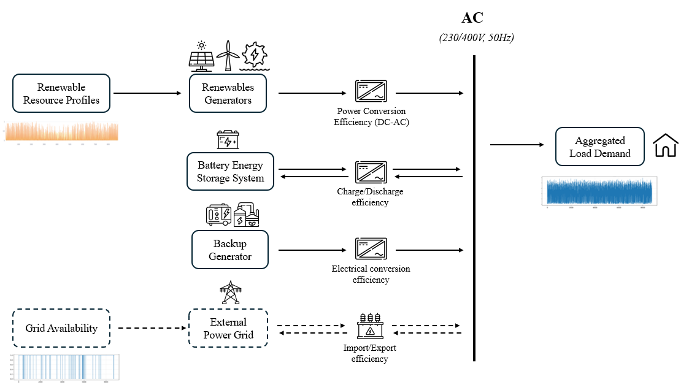

# Methodology Overview

**MicroGridsPy Planning** is a bottom-up, open-source optimization tool for the planning of
energy systems in remote and underserved areas. The model is implemented in **Linopy**, a
Python-based optimization framework, and provides an open and transparent approach to the
sizing and dispatch of mini-grids. It explicitly addresses the challenges of energy-system
scaling, technology selection, and operational planning in contexts characterized by
**limited data availability, high uncertainty, and strong economic constraints**.

## An integrated modelling platform

MicroGridsPy is part of a broader **integrated modelling platform** designed to address the
interrelated challenges of rural electrification within the **Comprehensive Energy System
Planning (CESP)** methodology — a collection of interoperable, open-source Python tools, each
targeting a stage of the electrification-planning process:

```text
Distribution-grid topology     GIS-based network design; who is grid-connected vs stand-alone
        ↓
Load demand assessment         RAMP: stochastic, seasonal, evolving demand; rural archetypes
        ↓
Resource assessment            PVGIS API: solar irradiation and wind speed time series
        ↓
MicroGridsPy optimization      optimal sizing and least-cost energy mix (this tool)
        ↓
Dispatch simulation            load-following / cycle-charging; degradation, control strategies
        ↓
Power-flow analysis            congestion and energy flows once nodes are defined
```

This ecosystem framing is preserved because it defines the well-specified data interfaces
that let each stage remain modular — see the
[internal data contract](../data-reference/data-contract.md).

## Reference energy system and technology scheme

The modelled system exchanges power through a common **AC system bus**, the central balance
point of the model. Conversion efficiencies are applied between each technology and the bus
to represent losses in power electronics, electrical conversion, or system interfaces. The
main components are:

- **Renewable generation technologies** — generic renewable units driven by resource-
  availability profiles and techno-economic parameters. This flexible representation covers
  photovoltaics, wind turbines (with optional power-curve representation), small hydro, or
  other renewable resources describable through a production time series.
- **Battery energy storage system (BESS)** — a single aggregated battery bank characterized
  by state-of-charge dynamics, charge/discharge limits, depth of discharge, degradation, and
  round-trip efficiency. Storage shifts renewable generation in time and supports reliability.
- **Backup generator** — a single dispatchable unit (diesel, biomass, or other controllable
  technology) defined through efficiency and fuel-consumption parameters.
- **External grid connection** *(optional)* — import and optional export, subject to grid
  availability (outages) and limited connection capacity.
- **Aggregated electrical demand** — the total system load, modelled as an aggregated time
  series rather than node-level loads.



*Conceptual technology interaction scheme used in MicroGridsPy. The diagram represents the
modelled connections between technologies and the common AC system bus rather than a physical
electrical layout. **Dashed** elements (grid connection) are optional components activated
through parameter settings.*

### Technology activation and model flexibility

The scheme is highly modular: individual components are activated or deactivated through
**parameter settings** rather than structural model changes. In particular, a technology can
be effectively disabled by assigning:

- **Zero nominal (or maximum installable) capacity** — removes the component from the system
  (e.g. zero generator capacity forces operation without backup).
- **Unity conversion efficiencies** — neutralizes conversion losses: the step remains in the
  formulation but introduces no losses.

!!! warning "Model flexibility and input consistency"
    Because technologies can be enabled or disabled through parameter values, inconsistent
    input combinations may lead to infeasible configurations or misleading results. Typical
    pitfalls: disabling all generation while keeping positive demand; assigning zero storage
    while imposing strict renewable-penetration constraints that cannot be met; or combining
    incompatible degradation, lifetime, or efficiency assumptions. Ensuring internal
    consistency of inputs is the user's responsibility.

## Stochastic structure

The optimization runs at **hourly resolution** and can account for multiple **scenarios**
$\omega \in \Omega$ representing alternative realizations of time-dependent parameters
(demand, renewable availability, grid conditions), each with a probability $p_\omega$. The
formulation is a **two-stage stochastic optimization problem with recourse**, solved in
deterministic-equivalent form:

- **Here-and-now decisions** — system sizing and investment are **shared across all
  scenarios**, ensuring a robust design.
- **Recourse decisions** — operational (dispatch) decisions adapt **separately to each
  scenario**, minimizing expected cost.

Both planning modes can represent a fully off-grid (isolated) system or a weakly
grid-connected one, governed by a **grid-availability matrix**.

## Planning workflow

```text
Demand + resource inputs
          ↓
Technology characterization
          ↓
Investment decisions        (here-and-now, shared across scenarios)
          ↓
Hourly operational decisions (recourse, scenario-specific)
          ↓
Economic accounting
          ↓
Least-cost system configuration
```

## Planning modes

Two complementary formulations are available:

- **[Typical-Year Planning](planning-modes.md#typical-year-planning)** — a steady-state
  approximation described by a single representative operating year.
- **[Multi-Year Planning](planning-modes.md#multi-year-planning)** — a dynamic formulation
  over a horizon $y = 1,\dots,H$ where decisions and exogenous parameters evolve over time.

Both are investment-oriented and rely on an annuity-based cost formulation.

## How the methodology is organized

| Page | Content |
|---|---|
| [Planning Modes](planning-modes.md) | typical-year vs. multi-year; two-stage stochastic structure |
| [Objective Function](objective-function.md) | NPWC and EAC objectives, CRF, WACC, end-of-horizon accounting |
| [Cost Accounting](cost-accounting.md) | investment, fixed O&M, operational costs, externalities |
| [Renewable Technologies](renewable.md) | generic production, capacity availability, land use |
| [Battery](battery.md) | flow, SOC, capacity, advanced loss and degradation models |
| [Generators](generator.md) | capacity, nominal and part-load fuel relationships |
| [Grid Connection](grid.md) | import/export, grid efficiency, cost/emissions, availability |
| [System Constraints](constraints.md) | energy balance, renewable penetration, lost load |
